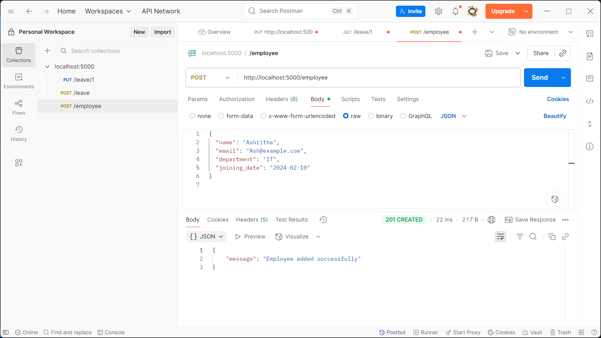
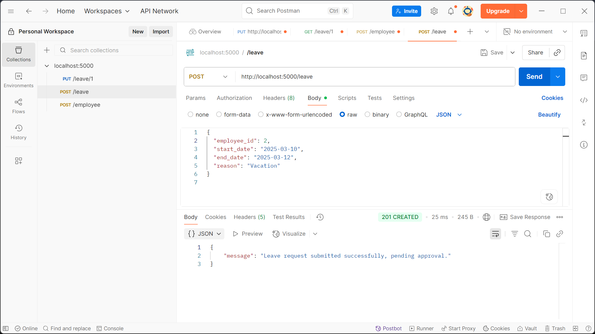
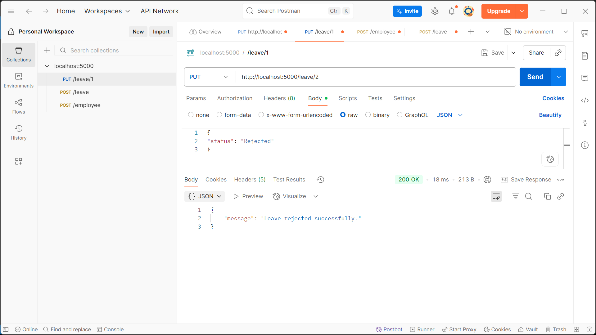
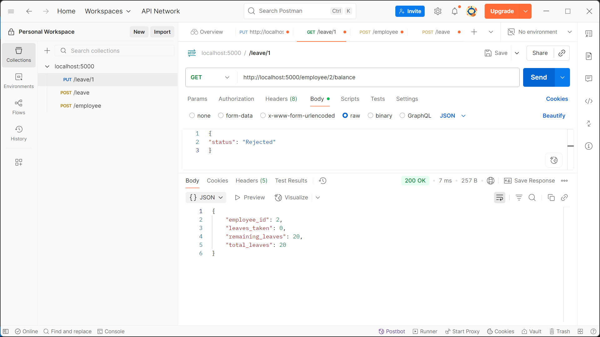
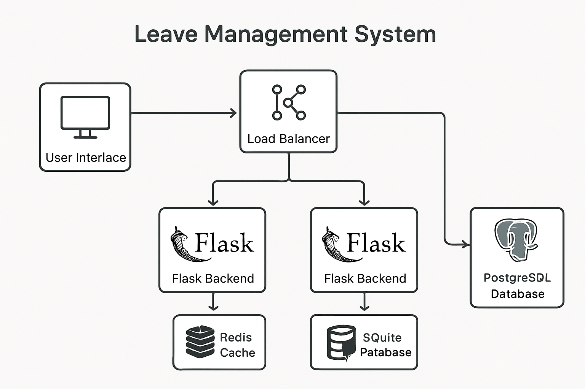

# 🗂 Leave Management System (Flask + SQLite)

A simple **Leave Management System API** built using **Python (Flask)** and **SQLite**.  
It supports adding employees, applying for leave, approving/rejecting requests, and checking leave balance.

---

## 📌 Features
- Add new employees with unique email IDs.
- Employees can apply for leave with start & end dates.
- HR/Admin can approve or reject leave requests.
- Tracks leave balance for each employee.
- Input validation & error handling.
- SQLite database for data storage.

---

## 🛠 Tech Stack
- **Backend**: Python 3.x, Flask
- **Database**: SQLite
- **Tools**: Postman (for API testing)

---

## ⚙️ Project Setup

### **1. Clone the Repository**
git clone https://github.com/Ashritha-Gollapalli/leave-management-system.git
cd leave_management_system

### **2. Create Virtual Environment** *(optional but recommended)*
python -m venv venv
source venv/bin/activate # Linux/Mac
venv\Scripts\activate # Windows

### **3. Install Dependencies**
pip install -r requirements.txt

### **4. Initialize the Database**
python database.py

*(Creates `database.db` with Employees & LeaveRequests tables)*

### **5. Run the Application**
python app.py

The API will run at:  
`http://127.0.0.1:5000/`

---

## 📮 API Endpoints

### **1. Test Server**
**GET** `/`  
Returns:
{ "message": "Leave Management System API" }

---

### **2. Add Employee**
**POST** `/employee`
{
"name": "John Doe",
"email": "john@example.com",
"department": "IT",
"joining_date": "2025-01-10"
}

Response:
{"message": "Employee added successfully"}

---

### **3. Apply for Leave**
**POST** `/leave`

{
"employee_id": 1,
"start_date": "2025-03-10",
"end_date": "2025-03-12",
"reason": "Vacation"
}

Response:
{"message": "Leave request submitted successfully, pending approval."}

---

### **4. Approve/Reject Leave**
**PUT** `/leave/<leave_id>`
{
"status": "Approved"
}

   or

{
"status": "Rejected"
}

Response:
{"message": "Leave approved successfully."}

---

### **5. Get Leave Balance**
**GET** `/employee/<id>/balance`  
Example:
GET /employee/1/balance
Response:
{
"employee_id": 1,
"total_leaves": 20,
"leaves_taken": 5,
"remaining_leaves": 15
}

-----

## 📷 API Testing Screenshots

### 1. Add Employee

### 2. Apply for Leave

### 3. Approve Leave

### 4. Leave Balance

---

## ✅ Assumptions
- Each employee starts with **20 days total leave**.
- Dates are given in `YYYY-MM-DD` format.
- Weekends and holidays are **counted** in leave days (can be improved later).
- Only pending leave requests can be approved/rejected.

---

## 🔮 Possible Future Improvements
- Support half-day leaves.
- Department-based leave policies.
- Exclude weekends/holidays in leave calculation.
- Add authentication system.
- Deploy to cloud platform.

---

## 🖼 High-Level Design

**Basic Flow:**
[Postman/Frontend]
|
Flask API
|
SQLite Database

---
